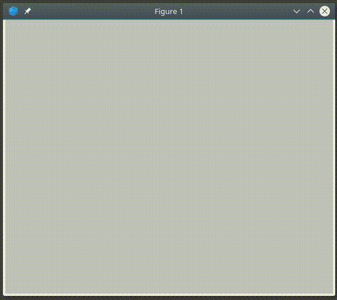

# The Game of Life
---
The 'Game of Life' is a 'cellular automaton', a simulation that shows how a simple beginning can give rise to complex mechanisms. A concept first devised by British mathematician John Horton Conway.

### Requirements
- Octave / Matlab

### Files
- `begin.m` - Source file. Includes comments.
- `begin_stripped.m` - A copy of the previous file. Does not include any comments.

### References
- Javascript implementation of Game of Life: http://pmav.eu/stuff/javascript-game-of-life-v3.1.1/
- Community dedicated to the Game of Life: http://conwaylife.com/
- Game of Life at Wolfram Mathworld: http://mathworld.wolfram.com/GameofLife.html
